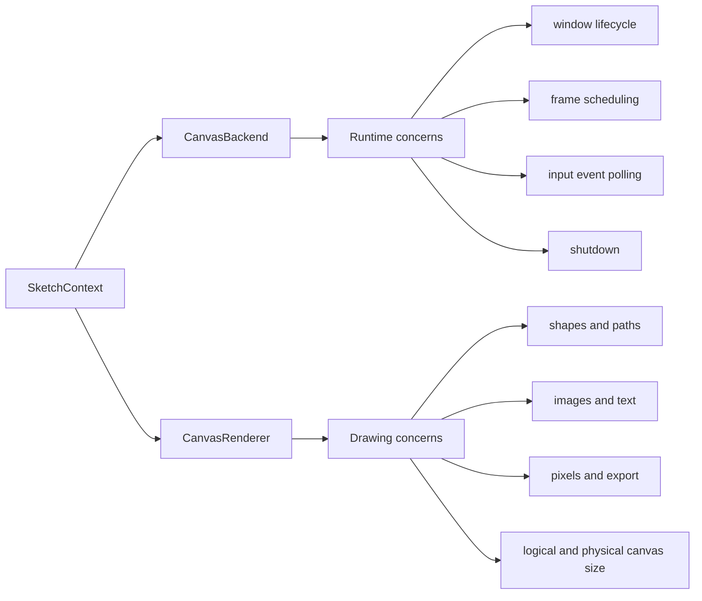
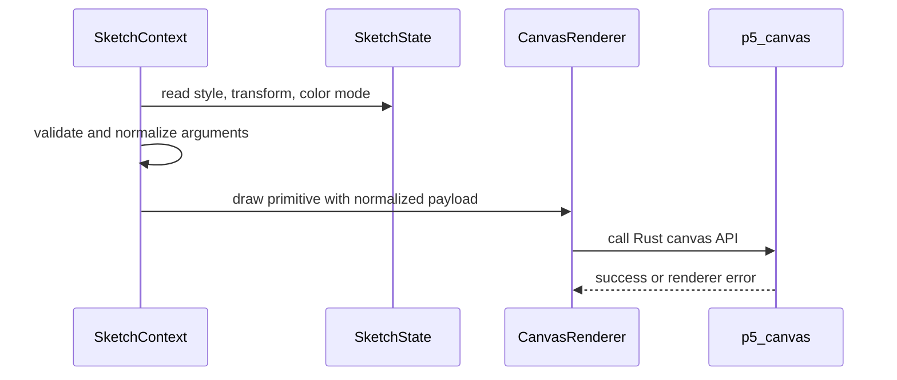

# Backend and Renderer Boundaries

The backend and renderer are intentionally separate because they solve different
problems.

## CanvasBackend

`CanvasBackend` is the adapter for runtime concerns. It does not decide p5 API
naming policy and should not contain drawing semantics such as how `rect_mode()`
changes a rectangle.

It is responsible for:

- constructing and owning the `CanvasRenderer`
- checking whether native interactive mode is available
- creating and resizing the canvas through the renderer
- choosing bounded headless execution or interactive execution
- opening native windows when supported
- scheduling frames at the requested frame rate
- polling Rust-originated input events
- normalizing mouse, keyboard, and touch events for `SketchContext`
- stopping and closing renderer resources

Most changes to `CanvasBackend` should be covered by contract tests or focused
unit tests with fake canvas modules/events.

## CanvasRenderer

`CanvasRenderer` is the adapter for drawing concerns. It should receive already
validated p5-level decisions from `SketchContext` and translate them into Rust
canvas calls.

It is responsible for:

- tracking logical canvas dimensions
- tracking physical backing-buffer dimensions
- tracking pixel density
- converting `Color`, style, transform, image, text, and path data into bridge
  payloads
- forwarding primitive drawing to the Rust extension
- reading and updating physical RGBA pixel buffers
- exporting the canvas
- closing runtime canvas resources

Renderer methods should not know about global-mode dispatch, plugin hooks, or
the sketch lifecycle.

## p5.rust.canvas

`p5.rust.canvas` is the Python wrapper around the optional import mechanics and
required runtime capability checks. The PyO3 module is required for current
runtime behavior, but imports can still fail in development environments.

This layer should:

- import `p5.rust._canvas`
- expose a small health-check and capability-check surface
- raise clear p5 exceptions when the extension is missing
- include rebuild guidance in capability errors

Do not leak raw extension import errors to sketch authors when a package-level
error would explain the problem better.

## Boundary Examples

Use these examples when deciding where code belongs:

| Change | Layer |
| --- | --- |
| Add a new public drawing function | `global_mode.py`, `__init__.py`, `SketchContext`, and maybe `CanvasRenderer`/Rust |
| Change how `rect_mode(CENTER)` computes coordinates | `SketchContext` or geometry helpers |
| Add a new Rust primitive call payload | `CanvasRenderer` and `crates/p5_canvas` |
| Improve missing extension error text | `p5.rust.canvas` |
| Poll a new native input event | `CanvasBackend` and Rust event support |
| Add a new pixel export format | `CanvasRenderer` and `crates/p5_canvas` |
| Change frame scheduling | `CanvasBackend` and lifecycle tests |

## Data Flow For A Draw Call

The context owns p5 behavior. The renderer owns translation. Rust owns actual
rendering.

