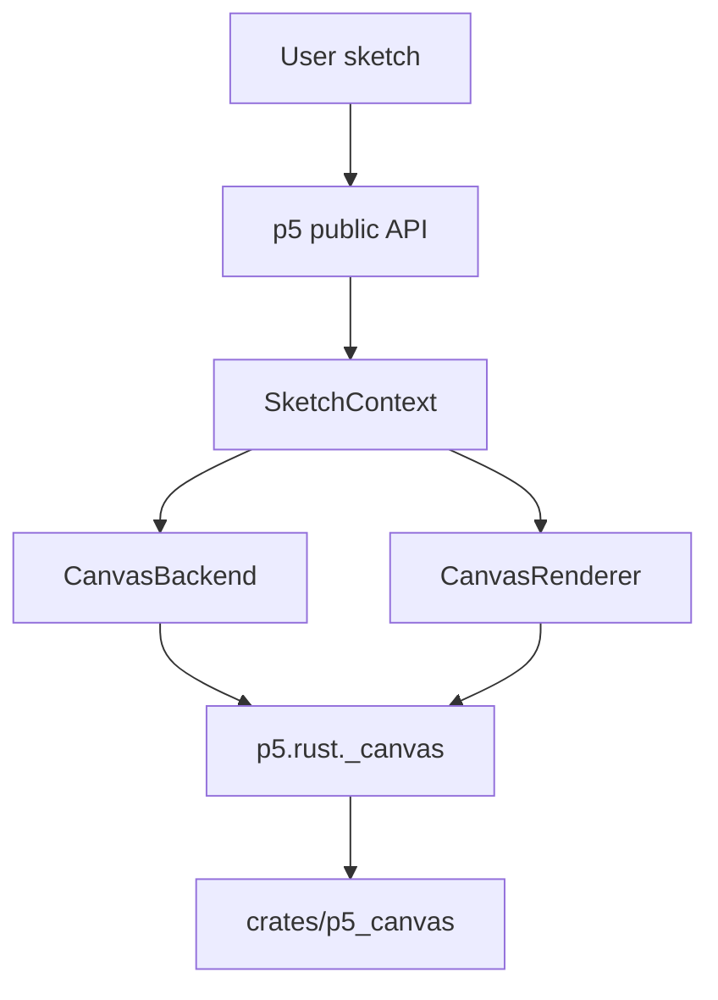

# Contributor Guide

These docs are for contributors who want to understand how p5py is built.

- [Architecture](architecture.md)
- [Backend and renderer boundaries](backend_renderer.md)
- [Runtime model](runtime.md)
- [API performance policy](api_performance_policy.md)
- [Native 3D renderer plan](native_3d_plan.md)
- [Testing and CI](testing.md)
- [Documentation workflow](documentation.md)

## Project Shape



p5py is canvas-first. The Rust `p5_canvas` extension is the required runtime for
drawing, presentation, image loading, pixels, export, text, and native
window/input support when available.

## Reading Order

Start with [Architecture](architecture.md) if you are new to the project. It
explains the main Python objects and how a public API call reaches the renderer.

Read [Backend and renderer boundaries](backend_renderer.md) before changing
anything in `src/p5/backends/`, `src/p5/rust/`, or `crates/p5_canvas/`. Most
runtime regressions come from putting a behavior in the wrong layer.

Read [Runtime model](runtime.md) before touching lifecycle, frame scheduling,
interactive mode, headless mode, input dispatch, HiDPI behavior, or current
software WEBGL behavior. Read [Native 3D renderer plan](native_3d_plan.md)
before moving WEBGL drawing into `p5_canvas`.

Read [API performance policy](api_performance_policy.md) before adding public
APIs, changing pixel/image behavior, or documenting performance-sensitive
drawing patterns.

Read [Testing and CI](testing.md) before adding tests or changing workflows.

## Local Commands

```sh
uv sync --dev
uvx maturin develop --manifest-path crates/p5_canvas/Cargo.toml --module-name p5.rust._canvas --python-source src --features extension-module
uv run ruff check .
uv run mypy src
uv run pytest
```

## Design Constraints

- Keep public APIs Pythonic and `snake_case`.
- Do not add JavaScript, HTML, DOM APIs, browser dependencies, or browser-only
  runtime paths.
- Do not reintroduce Pillow or Pyglet fallback rendering.
- Keep `p5.rust._canvas` required for canvas runtime behavior.
- Keep Rust implementation details out of user-facing API names.
- Prefer deterministic headless tests for behavior changes.
