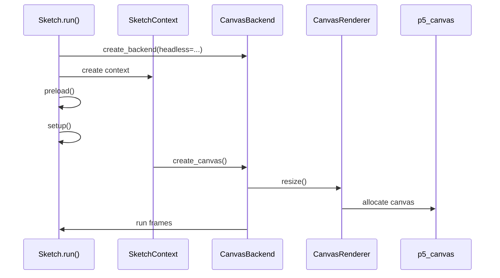
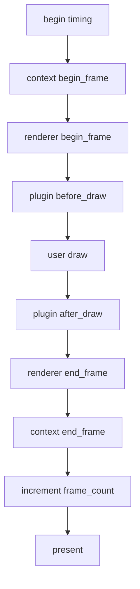
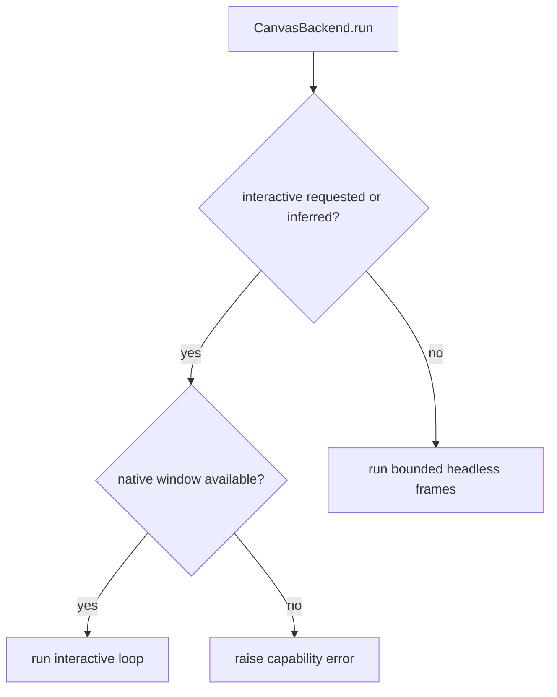
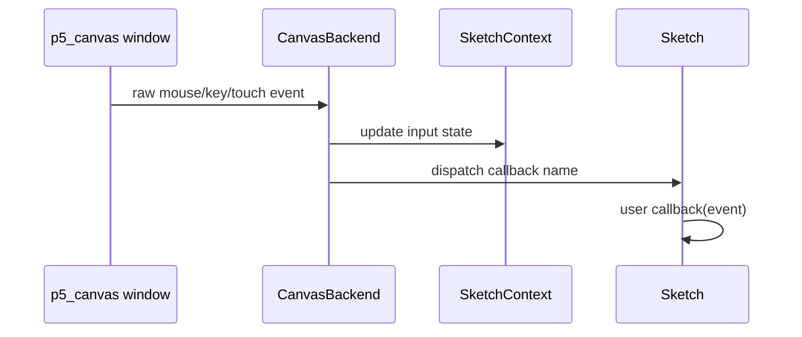

# Runtime Model

The runtime is canvas-first and bounded/headless runs still use `p5_canvas`.
There is no supported Pillow or Pyglet fallback.

The runtime starts in Python, creates a Python context, and then uses the Rust
canvas extension for canvas work. Rust can provide native window and input
events, but Python still owns the sketch lifecycle.

## Startup Sequence

`Sketch.run()` performs these high-level steps:

1. Build a backend with `create_backend(headless=...)`.
2. Create `SketchContext(sketch, backend, plugins=...)`.
3. Bind plugin runtime state.
4. Activate the context so global-mode functions can find it.
5. Dispatch `before_preload` plugin hooks.
6. Run user `preload()`.
7. Dispatch `before_setup` plugin hooks.
8. Run user `setup()`.
9. Ensure a canvas exists, creating the default canvas if needed.
10. Dispatch `after_setup` plugin hooks.
11. Ask the backend to run frames.

The key point is that the backend does not call `setup()` or `draw()` directly.
`Sketch` owns callback order; `CanvasBackend` owns runtime execution.

## Frame Order

Keep this ordering intact when changing lifecycle behavior.

## Frame Scheduling

The draw loop checks p5 lifecycle flags before drawing:

- if `state.looping` is true, draw every scheduled frame
- if `state.redraw_requested` is true, draw one frame even when looping is off
- otherwise skip drawing

`no_loop()` sets `state.looping` false. `loop()` sets it true. `redraw()` marks a
single frame as requested. After a frame is drawn, `redraw_requested` is cleared.

Interactive runs schedule frames according to the target frame rate and poll
native events between frames. Headless bounded runs draw a fixed number of frames
as quickly and deterministically as possible.

## Headless vs Interactive

- `headless=True` or `--headless`: bounded offscreen canvas behavior for tests,
  CI, export, and repeatable scripts.
- `headless=False` or `--interactive`: native interactive behavior when the
  installed extension supports it.
- Missing canvas extension or missing native-window support should fail with a
  clear capability error and rebuild guidance.

## Input Dispatch

When native input is available, Rust emits window/input events. `CanvasBackend`
polls those events, normalizes them into Python event dataclasses, updates
`SketchContext.state.input`, and then dispatches optional user callbacks.

Input state should always be updated before the user callback runs, so callback
code sees the same values that later p5 input functions return.

## HiDPI

p5py separates logical and physical size:

- `width()` and `height()` return logical dimensions.
- `pixel_density()` controls physical backing scale.
- `load_pixels()` and `update_pixels()` operate on physical top-left RGBA
  buffers.

Do not collapse logical and physical dimensions when touching renderer, export,
pixels, image, or input coordinate code.

## Canvas Creation And Synchronization

Canvas creation is a cross-layer operation:

1. `SketchContext.create_canvas()` validates the renderer kind and backend
   capability.
2. `CanvasBackend.create_canvas()` forwards the requested logical size and pixel
   density to the renderer.
3. `CanvasRenderer.resize()` asks Rust to allocate or resize the canvas.
4. `SketchContext._sync_canvas_state()` copies renderer dimensions back into
   `SketchState.canvas`.

If a change resizes the canvas but does not synchronize `SketchState.canvas`,
`width()`, `height()`, `pixel_density()`, pixels, export, and input coordinates
can disagree.

## Failure Modes To Preserve

- Missing `p5.rust._canvas` should raise a clear backend capability error.
- Requesting interactive mode without native-window support should raise a clear
  capability error.
- Unsupported renderer names should raise `ArgumentValidationError`.
- Requesting `WEBGL` on a backend without 3D support should raise
  `BackendCapabilityError`.
- Pixel operations should report capability problems explicitly instead of
  failing with unrelated buffer errors.
