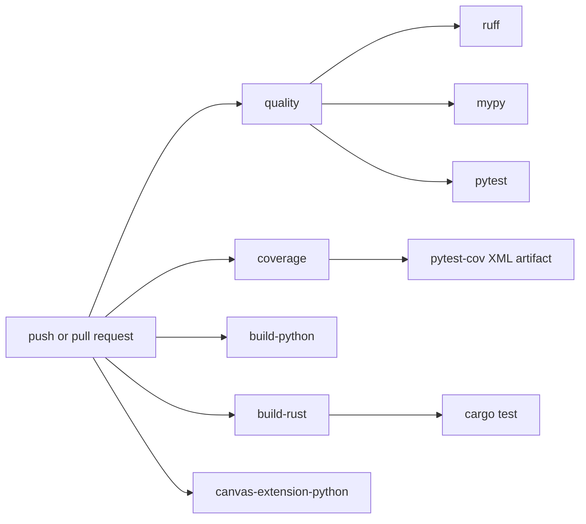

# Testing and CI

Use the smallest checks that cover the change.

## Common Checks

```sh
uv run ruff check .
uv run mypy src
uv run pytest
uv run python examples/01_getting_started/basic_shapes.py --headless --frames 1
cargo test --manifest-path crates/p5_canvas/Cargo.toml
```

For coverage locally:

```sh
uv run pytest --cov=p5 --cov-report=term-missing --cov-report=xml
```

## Choosing The Right Check

Use focused checks while developing, then broaden before handing off:

| Change type | Minimum useful check |
| --- | --- |
| Pure Python API/state logic | targeted `uv run pytest tests/unit/...` |
| Public API export changes | unit tests plus `uv run mypy src` |
| Backend scheduling or capability behavior | `tests/contracts/` plus relevant unit tests |
| Renderer or pixel behavior | contract or integration test plus a headless smoke example |
| Rust canvas runtime behavior | `cargo test --manifest-path crates/p5_canvas/Cargo.toml` plus Python wrapper tests |
| Documentation only | link/path review; no full test suite required unless commands changed |
| CI workflow changes | local command equivalence where practical |

## Test Placement

- `tests/unit/`: pure API, state, assets, events, and wrapper behavior.
- `tests/contracts/`: backend and renderer promises.
- `tests/golden/`: deterministic render comparisons.
- `tests/integration/`: end-to-end sketch behavior.
- `tests/benchmark/`: opt-in performance tests.

## Test Style

Prefer deterministic tests:

- Use bounded headless runs with `max_frames` for sketch behavior.
- Use fake canvas modules or fake runtime objects for capability and event edge
  cases.
- Assert public behavior instead of private implementation details when the
  public behavior is stable.
- Use contract tests when multiple backend/renderer implementations would be
  expected to satisfy the same promise.
- Keep benchmark tests behind the explicit benchmark marker.

Avoid tests that require manual native windows unless the behavior cannot be
reasonably covered headlessly.

## CI Layout



Coverage is reported in the job summary and uploaded as `coverage-xml`.

## What Each CI Job Proves

- `quality`: verifies the main contributor path: install dev dependencies,
  build the required canvas extension, lint, type check, version check, run the
  Python test suite, and smoke-test an example.
- `coverage`: runs the Python test suite with coverage instrumentation and
  uploads `coverage.xml`.
- `build-python`: verifies `uv build` can produce Python distributions.
- `build-rust`: verifies optional acceleration and required canvas Rust builds,
  and runs canvas crate tests.
- `canvas-extension-python`: focuses on Python tests that require the canvas
  extension.

If a job starts failing after a change, first identify which ownership boundary
the job covers. For example, a failure only in `build-rust` is usually a crate
or packaging issue, while a failure in `quality` after Rust builds successfully
is usually Python API, test, or example behavior.

## Coverage Reporting

The coverage job intentionally reports coverage without enforcing a threshold.
That makes coverage visible without blocking unrelated maintenance work. Add a
threshold only after the project has agreed on a baseline and exclusion policy.

## Backlog TOML

If you edit backlog items, preserve the existing `priotity` key spelling and
validate the files:

```sh
uv run python -c "from pathlib import Path; import tomllib; [tomllib.load(p.open('rb')) for p in sorted(Path('backlog').glob('**/*.toml'))]; print('Backlog TOML parsed successfully')"
```
