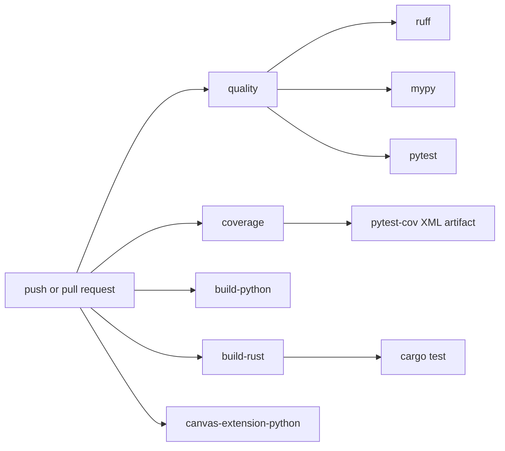

# Testing and CI

Use the smallest checks that cover the change.

## Common Checks

```sh
uv run ruff check .
uv run mypy src
uv run pytest
uv run python examples/01_getting_started/basic_shapes.py --headless --frames 1
cargo test --manifest-path crates/p5_canvas/Cargo.toml
```

For coverage locally:

```sh
uv run pytest --cov=p5 --cov-report=term-missing --cov-report=xml
```

## Choosing The Right Check

Use focused checks while developing, then broaden before handing off:

| Change type | Minimum useful check |
| --- | --- |
| Pure Python API/state logic | targeted `uv run pytest tests/unit/...` |
| Public API export changes | unit tests plus `uv run mypy src` |
| Backend scheduling or capability behavior | `tests/contracts/` plus relevant unit tests |
| Renderer or pixel behavior | contract or integration test plus a headless smoke example |
| Rust canvas runtime behavior | `cargo test --manifest-path crates/p5_canvas/Cargo.toml` plus Python wrapper tests |
| Documentation only | link/path review; no full test suite required unless commands changed |
| CI workflow changes | local command equivalence where practical |

## Test Placement

- `tests/unit/`: pure API, state, assets, events, and wrapper behavior.
- `tests/contracts/`: backend and renderer promises.
- `tests/golden/`: deterministic render comparisons.
- `tests/integration/`: end-to-end sketch behavior.
- `tests/benchmark/`: opt-in performance tests.

## Performance Benchmarks

Runtime performance checks live under `tests/benchmark/` and are skipped unless
explicitly requested:

```sh
uv run pytest tests/benchmark/test_canvas_backend_perf.py --run-benchmarks
uv run pytest tests/benchmark/test_api_overhead_perf.py --run-benchmarks
uv run pytest tests/benchmark/test_image_pipeline_perf.py --run-benchmarks
uv run pytest tests/benchmark/test_webgl_3d_perf.py --run-benchmarks
```

The canvas backend benchmarks require the `p5.rust._canvas` extension and run in
bounded headless mode, so they do not open a native window. Each run reports
frames per second plus the canvas size, pixel density, backend mode, Python
version, and platform. Every canvas benchmark scenario must average at least
120 FPS. A below-threshold failure is an optimization signal, not a reason to
loosen the benchmark.

Use the suite when changing renderer hot paths, image upload/cache behavior,
pixel readback/update behavior, text measurement, frame scheduling, or native
canvas packaging. The current scenarios cover sparse and dense primitive
drawing, cached image drawing with default linear and nearest sampling,
per-frame image upload churn, mixed text/pixel readback work, a deterministic
game-style scene, and a WEBGL-style 3D prototype scene.

The API overhead microbenchmarks use a no-op renderer/backend and do not require
the canvas extension. They report nanoseconds per call for global-mode,
object-oriented sketch, context-direct, `fast()` facade, and renderer-direct
paths so Python dispatch overhead can be compared separately from renderer
work. The `fast()` cases should remain below equivalent global-mode dispatch
for dense-loop operations.

The image pipeline benchmarks measure image-local operations such as region
copy, resize, mask, filter, get, and set, plus list-based and bytes-based pixel
workflows. Use them when changing `Image`, `P5Image`, `load_image()`,
`load_pixels()`, `load_pixel_bytes()`, `update_pixels()`, or image cache
behavior.

The WEBGL 3D benchmarks exercise the current software-projected 3D path for
box, sphere, textured plane, imported model, and repeated primitive scenes.
They are frame-style benchmarks and keep the same 120 FPS target; failures are
expected optimization signals until native 3D or additional software
optimizations land.

Checked-in baseline snapshots live in `tests/benchmark/baselines/` as TOML.
Each baseline records the command, machine/configuration, commit, canvas size,
pixel density, backend mode, frame count or iteration count, and whether GPU
availability is known. Canvas baselines also record the required 120 FPS floor
and whether each captured scenario met it. To compare an optimization branch,
run the same command on the same machine, compare each scenario's mean/min/max
against the matching baseline, and describe material changes as percentages. Do
not compare absolute FPS or nanosecond values across different machines, OS
versions, Python versions, build modes, or power/thermal states.

Do not edit baseline numbers upward to satisfy the target. Keep captured values
as measured and let benchmark assertions fail until the implementation reaches
the required floor.

## Test Style

Prefer deterministic tests:

- Use bounded headless runs with `max_frames` for sketch behavior.
- Use fake canvas modules or fake runtime objects for capability and event edge
  cases.
- Assert public behavior instead of private implementation details when the
  public behavior is stable.
- Use contract tests when multiple backend/renderer implementations would be
  expected to satisfy the same promise.
- Keep benchmark tests behind the explicit benchmark marker.

Avoid tests that require manual native windows unless the behavior cannot be
reasonably covered headlessly.

## CI Layout



Coverage is reported in the job summary and uploaded as `coverage-xml`.

## What Each CI Job Proves

- `quality`: verifies the main contributor path: install dev dependencies,
  build the required canvas extension, lint, type check, version check, run the
  Python test suite, and smoke-test an example.
- `coverage`: runs the Python test suite with coverage instrumentation and
  uploads `coverage.xml`.
- `build-python`: verifies `uv build` can produce Python distributions.
- `build-rust`: verifies optional acceleration and required canvas Rust builds,
  and runs canvas crate tests.
- `canvas-extension-python`: focuses on Python tests that require the canvas
  extension.

If a job starts failing after a change, first identify which ownership boundary
the job covers. For example, a failure only in `build-rust` is usually a crate
or packaging issue, while a failure in `quality` after Rust builds successfully
is usually Python API, test, or example behavior.

## Coverage Reporting

The coverage job intentionally reports coverage without enforcing a threshold.
That makes coverage visible without blocking unrelated maintenance work. Add a
threshold only after the project has agreed on a baseline and exclusion policy.

## Backlog TOML

If you edit backlog items, preserve the existing `priotity` key spelling and
validate the files:

```sh
uv run python -c "from pathlib import Path; import tomllib; [tomllib.load(p.open('rb')) for p in sorted(Path('.scratch/backlog').glob('**/*.toml'))]; print('Backlog TOML parsed successfully')"
```
